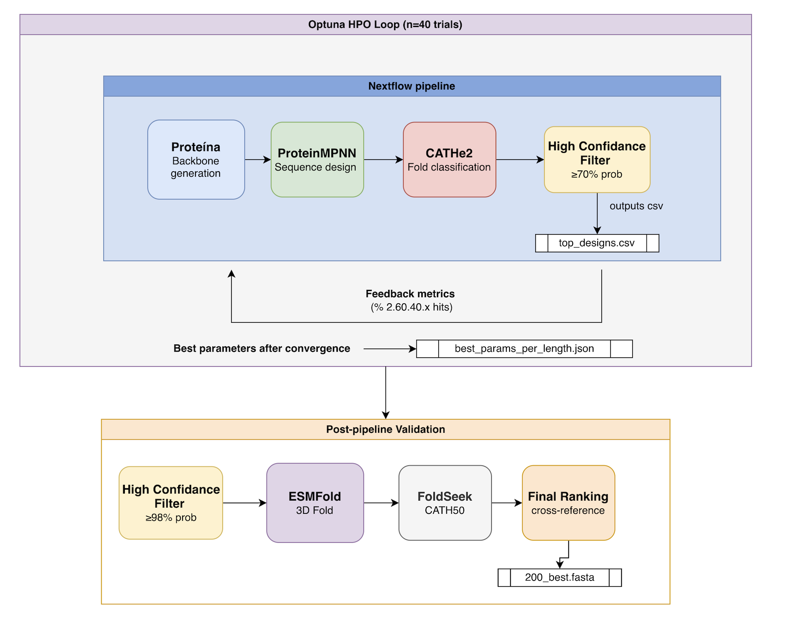

# Immunoglobulin Protein Design Pipeline


Generative protein design pipeline for immunoglobulin backbone generation and fold validation using flow-based models and graph neural networks.


## Overview

Computational design of novel proteins remains a major challenge at the intersection of bioinformatics and generative machine learning. This project implements an end-to-end protein design pipeline for **immunoglobulin-like folds** (CATH 2.60.40.x), combining backbone generation, sequence design, fold classification, and structural validation in a single reproducible workflow.


For a detailed explanation of the theoretical aspects of the project, consult [`docs/theory.md`](docs/theory.md), and a precise technical breakdown can be found at [`docs/technical.md`](docs/technical.md).


## Architecture
The pipeline follows this workflow:

1. **Bayesian hyperparameter optimization** (optional, for tuning) – Optuna sweeps 
   Proteína's and ProteinMPNN's generative parameters (`guidance_weight`, `autoguidance_ratio`, 
   `caflow_noise_scale`, `sampling_temp`) by running the Nextflow pipeline 40+ times 
   (~20 min/trial) and measuring the % of high-confidence immunoglobulin hits.

2. **Single Nextflow pipeline run** – Generates backbones → designs sequences → 
   classifies folds with CATHe2 → filters to ≥70% confidence → outputs top candidates 
   to `top_designs.csv`.

3. **Post-pipeline structural validation** – Filters to ≥98% confidence, folds 
   structures with ESMFold, searches them against CATH50 with FoldSeek, and 
   cross-references CATHe2 + FoldSeek hits to rank final candidates. Produces 
   `200_best.fasta`.




## Documentation

Full documentation is in the [`docs/`](docs/) directory:

| File | Contents |
|---|---|
| [`docs/contributing.md`](docs/contributing.md) | Guide on how to use git to contribute to project |
| [`docs/setup.md`](docs/setup.md) | Environment setup, installation, and step-by-step usage |
| [`docs/theory.md`](docs/theory.md) | Theoretical background: protein biology, flow matching, all models |
| [`docs/technical.md`](docs/technical.md) | Technical reference: pipeline internals, config, scripts, artifact layout |


## Results
The 200 sequences below were selected as the strongest validated candidates from the pipeline.

Each sequence:
- was classified by CATHe2 as immunoglobulin-like (CATH 2.60.40.x) with probability **≥ 98%**
- was folded with ESMFold
- produced a predicted structure whose FoldSeek hit was also classified as immunoglobulin-like in CATH

<details>
<summary>200 Best Validated Immunoglobulin AA Sequences</summary>
PSVVEVPKGVLRVFDDLLVTVPANRDLRVIAHQNTEVLTKRLLAADYTVQHRIVMLAPGEASTLPLRQLRPGKYVLHAQNIQTANQSRAGILVQE
GTLYLQTEKTVFKQDEVLHLRALIRGEERDWKGVTLRILNDKGELVKKLTSSPFRFNAAEFDIRVRHRQGNYRVVIEMTDVDGSKLTRELTIEVE
QQIVTVSGGVLAHDPASNITIPRNHALQVENKDAVPWVLRHTDMHSRRVVAGPVTLTTSQTKTWIDLKPLEPGQYQLQATNSNGSVQICNLTVVS
MGFSPASVTLAAGETATLTLVLDDDAVVHGFTLLKDGTPIAPATDGSGFQLLDDGRKVRLTSTTSGTGLTATLTLVLHTADEERTLTATVTGVAP
ENVTVTLDQTSYDIGTTVTVQISLSRAPSSPMIVRLGVLDSHRKLVHAKEQSADQQASLTLKLTYTGDAGNYTLSVSISSPSGKKASSQLVFQVK
AMFHVVTIQQGTLSLSPGNIISQSGRLLVKNMDEHDYLVTLFLYVGQIPKRVDVGEELQPGHATNPIPKWNLPSGEYKLVAVNKENKAVLSIRIQ
NVVLQCKSGKLLFGEDQPLRVENSHPLKVNNINNISQLDFLSLISNNVNQNEAKNVYPNEYVEFDLTRLRPGEYRIHCREVDSGKRHLCTLEVTQ
MRLVLKLERSVYRKNEYVYFSVSLEGNWRNWRELIFLVKDKAGNVLHEQKFSPFETQHFFHRYKANFEDGDYDVQVEATWQDFRYVLAHADIRVN
NVEIQCKNGKLLKGDAQPVRVENSHPLKVNTFNYKSQLDFLSLISNNVNQNEAKNVYPNEYKEFDLTRIRPGEYRIHCIEVDSGKRHLCTLEVYE
TTEVKVVVRNGVLELAEGAELEPGETLSITNENPVMDDIWVYREEGENENLLPGWSHVYPNRTYTTVLPSTIKRGIYKVVSQSAKFADSVEFNVP
KSTAIVEVNDGKVTIISGEVLDSQGEIVIENKSKAVINVKVWFAMGGMVQLVDMLTGIKPGQVKTSKITVNVTGGILEITCTHNEGNGRTMILIN
THTIEVQVRNNKAVCTGPGELKVKVGETEVVNVTNASMDKELVAELYDARGNSLATVKAGAGAPTLSLRIDDPGLTDFRITITLTDGHTCTVTLEVVVGT
APAERFLSLTLDEKTYRQGDIVTISSENLSRTFDLTINIFKHSSNGRLVEVLVKNDIVSPLSRTAKQFTVEEPAGIFIFQAIARRGSRACRFLLEIINVN
SNVITVVIKNGILEEIKGTNIGPGEVVNVTNSDYEPHTFVVELNEQDKKITVKTLQDVPPGMAKEWVAEENEQTGLYIITANGATHQSSVAFSLS
YCVIPLLQKNIYQRGEDVLVRIQFSEAHNYPYTVKLILLDSEGYVVHVHTERDKKEKMLNLNYRVEELPYDEFLRALVTSKNGQVLEAKAFLRVE
GLLTLQLDKSNYKTGTVAYLRIVMAYRLFSDGAVRFSVKDYFGRELKLDELQLRRVTEIMKEFTVNFSIGVYKVEATLLEPDDSRRSASSSITVE
TDEAKVVVRNGVYEIAEGAQLGREGTLSITNENPVADRIWVGRVGPRGENEDIGSFIGYPNRTRTTVLRSTMGGEQLVVASQSAKFASAATINVP
PTLAVIVVKDHRAFLEKGDEVDPGGIVKFRNDAEETVTIEVNLNVDGIEILIHNYSQVMPGQEVVINIPKDLPSGKYWIMTTTAKYRDWVVLELT
GCVIPLLDKNIYQRGEDVLVRIQFSEAHNYPATVKLILLDSEGYVVHVRTESDKKEKMLNLNYRVEELPYDYFLRALVTYPNGQVLEAKAFLRVE
TDEAKVVVRNGVYEVAEGTELGREGTLSITNENPVPDTIWIYREEGENTNLLKTISHMYPNRTYTTVLRLTMGGGILKVVSQSAKGAGSATINIP
GLLTLQLDKSNYKTGTVAYLRIVMDYRLFSDGAVRFSVKDYFGRELKLDELQLRRVTEIMKEFTVNFSIGVYKVEATLLEPDDSRRSASSSITVE
RLLFTVSGANGELSIEPHNTIPLDGLIQFSNLGQSPLDFFLLYSDGGNSYECLSIENLPPGRTYRQFDTRAIPAGRYQIAMYTIEFEAQVDITIK
TDEVKVVVRNSVYEVAEGTELGREGKLSITNENPVMDTIWIYREEGENTNLLKTLSHVYPNRTYTTVLRLTMGGGILKVVSQSAKGAGSATINIP
MRPVYKHKLVVDVWHGAEYVSKGSVDIWLSTRELGEARVEIISENGVFIYDTFFEIEHFFHREQADLTDIDPGRYKVRAWTTFDYNYRHFDVRPN
AVCLRLSATRKKFPRGEIMLLVSADERSNFTLTISLENMNKTVIGTLYRGTSIFTEFYLPFDTSDLEDGWYKISAWLGWKQANHSIDIVQ
GLLTLQLDKSNYKTGTVAYLRIVMDYRLFSDGAVRFSVKDYFGREVKLDELQLRRVTEIMKEFTVNFSIGVYKVEATLLEPDDSRRSASSSITVE
NVEIQAKNGKLLAGDAQPVRVENSHPLKVNTFNIGSQLDFLSLISNNVNQNEAKNVYPNEYVEFDLTRIRPGEYRIHCIEVDSGKRHLHTLKVTE
ATIELRTRSFHYAKGQTVNHSISLEESAREDRLITLEVLDEDGTVVKKWKTFSNNRREVVFRSVLEFEGGRYLLTAFVTTLDGGVWEANTKIDVK
SEEITVVIKNGQVEEIKGTNVGKDFVLNLTNSDYEPHTFVVEANEQDKKITVKTLQDVRPGMAKEWSAELNEDTKLDIKAFNGDGHVSSVAISVS
TEQAWILRVGTDKAEYHAATTNYVRYWAPNETQLTIRLLEKDWNLKKKIKEEQWPPGFNTTTERISFVNLKPGDYYILALLSTADERYAEFRWSG
VPETRPRLKDISIGPGQGVNIDQPVQVQASITKRDELDLRLIGRDRSISVLLRELRHGSSVSTLFPLRPLTPGDYIVQAFTDWVEGYRPLHTFQP
RQPLYTQRLVVLVNNGMPYVFKGDVLVKVCHKEQGTVRYEVLMDNNNKVMDEMITLRQDCLDYTFDTTNNQIGDYTFRAATDSLEAESQFTLKEQ
ATIELRTRSFHYAKGQTVNHSISLEESAREDRLITLEVLDADGTVVKKWKTFSNNRREVVFRSVLEFEGGRYLLTAFVTTLDGGVWEANTKIDVK
RLVKELKIDQWQEFPETAEITAIRIEVTDDDAENLEVKSAKVNEIPVSLVEDGSTLILDLRDNPLAVDKGDILRISIEFSAYKMYTVGSRIQTHRADGSRAGYDLHWTIG
PPLVIVADNVLGVPDASKITMNGDSSLDVENKDNEAVTLELVDSSSGKVVTGPFGLRAAGDKQGFDLTAGPEGKYYLWSRSHPKRQEKCNITVTK
ENVTVTLDQTSYDIGTTVTVQISLSRAPSSPMIVRLGVLDSHRGLVHATEQSADQQASLTLKLTYTAPAGNYTLSVSISSPSGKKASSQLVFQVK
RFVTLQLDRNYYLKNQDVLIKVIVTGENHRWKAVEIKMLSSDGTLVKQLNFNEFRDQKKTVRLTVNEKPGIMTIQVQLVDENEKSFEARHTVFIG
MTEVHIEVRGGEASITSGDSITPGGNIIINNSDDCVVNRSLLLKEDESAKQIQSWQDIEPGTLKVYSLPEDLPPGTYVAEVENETFWNKVYFHVE
MDEIEVVIKDGELSIRKGTRAGLKAKVRITNQSKSKVHVCVTMIAPGGEEAELYIGFLAAGETYELDVDFERPGCKLHIHGSSQEFSSTKTIEVL
AAVHSVTLAEGLLSLDPGTAIDLTDKLVIKNESFKVHHFNEHLVAGDKKIVVREIKRLFPGSSTPDFDLSKLQPGSYYIEATNQDFSASRKVTLQ
DCLTLLLEYETYAIGQELKLKDNLSQATQQDSLNTLQILDIKGRVLQQTEGMLQGQQTLTVVMTIQLPSGYRTFKSRVSYRDGSEFFSSSKFKVE
MVVCTFRDGKLGFPGHDAVNINNFTPLIIRNESEERITLQLRNVENECEVLGPFDKGPSGTLKETNLGRVPDGQYELYGTFRDKRKASCKIIVTQ
ALTEIKVYQVKVGDSLVDIQAWKEGNFLHLMITTATMKKPALITIIDNSNKVLMKTDFAPGGSYSTVIPDLGHSLLLKVSDGYNEISVIN
SSTVTVVIADGQVTITAGSALDPGDSLVLTNLGTAPTTFSLCHQVSKEEVELQTHTAVAPGQTVTIAIPKETPPGKYWLRSQNSTFECTATFELR
GLHEQAQNNNLTVRLKNGSEVTNEVLVEVTLAQDTPLLELSIINDNGEVVFTQKIENVPKNITVTVDVSWEPEGEYTVTVANEQGTKVNIQFTVK
SNSVTLVSKKGKLMIVSGKEVSPGGESTVYNKSYVPLNIALKRELLDEEIELDIKKQVDPAKQYKFRVPENVRDGLYKIVVISNKFNDTKDFRIS
RFVAEVTGNNLSVGTQKSLQIKIEKVLNIRTNNYPQVLDFLLLDRNGQVVRHERRVQPSQVAKIPLRDIPIMTYQLQAIDKLEGDEKKMHVVFIG
ATIELRTRSFHYAKGQTVNHSISLEESAREDRLITLEVLDEDGTVVKKWKTFSNRRREVVFRSVLEFEGGRYLLTAFVTTLDGGVWEANTKIDVK
DDVVYLQLSGGAVALVSKFKLEAGDVLKVINNDFNPWDLRILKETFDRAVELAKKENVNPNLTVSISDPKSLLPGRYTVQAVSGGFTDEADILLE
TSLQVTLDRSTYNLGEQVEVSIEFSSAESSDANLVLTVLSSEGEPILKLEQISQGKTDVQIFFTVEYQIGKYTLQVDRKDPTGKTEPASVTFEVK
SMTLQIDLEASAAGQKIQQGELIEYTETVISSEPVQLDLFIQNESNETLDLLEQTTREANQAKTIKKSANFKSGYYKLSLKTDNKVEDKPFWVTD
QSLQVTLDRSTYNLGEQVEVSIEFSSEESSDANLVLTVKSSEGEPILKLEQISQGKTDVQIFFTVEYQIGKYTLTVDRKDPTGKTEPASVTFEIK
GPESRVLIVDGKLSIVQGKQLPGTGNLVISNRSDKPYDIEVAHIAPSGKKEMVRSFTLQPGESRRIDLFFKEKGGTLKIIAATEDHIDEALVKVE
RLLPFAVQAFTVRPPEVHNRAFLTGSASGSTGQISIEVRDQLTSDALHSYSCTMESPGSLVRTYDFSPYRAGPYEARLRDEYAIEVAQQTFRVLR
DLHITVTDGIVEVTPEVQIPQNTYVRITIENKDGESLYVVITNTDTESVKINEEVGTGTKNYDLLAEQIGTIPLKVTFIAFDGTKNTATTTLTVS
DCLTLLLEYETYAIGQELKLKDNLSKATQQESLNTLQILDIKGRVMQQTEGYSFGRQTMTVVMTIQLPSGYRTFKSRVSYRDGSEFFSSSKFFVV
PKTVVIVVCNGRLRLIEGRELRPGGTVNIRNEDKRTQTVTIEHVVQATRVVLQTLNSVEPSSSYDVPLPAHTPEGQYIVCAESTQFRDETLFQVA
SNLTLNLSKKEYFQGESATVTVKYSESTSYDVKYVFQVYSSQGELLREYQADADTKQVLVAKFTVQYNKGNYRLYATAIFNDGNKLTATKDFRIS
ASTELVSFQNGHLTILSGSSMSPGETLQVNNNNANEPDFKIHFKDGAAWNTLQKCTNLKPGQTRLFVLPEDLPSGTYTIIVESAVFKDRVEVALK
ATIELHLDRDAYEQGEMVELTVVFSAAASSDVVLNLRCLDYKGVMWFGSEWKAQKQIKQVYTFTINLPNGHYLLTAWFTEPNGKQLEASVRFTIY
SAISLVADRRIYVQGESAQLHVILEEAPVEPALVRITVLDRQDRECKKMTSMMNKSRSCPWNFTPFFDKGYYHVAVQVTTPSKETLQDCRLIIIK
TTVSKVVVRNSVLYLAPGTQLPREGYVSFTNENPVMDTFWMYRKEGENWNLIPGWSHMYPNRTTPTIDVSTMKRGPYKFVSQSAKFAASLELNVP
MRLVLKLERSVYRKGEYVTFTVSASMPWREDTELIFTVKDKAGNVLHEQSFTAQQKKHFTVRVKANFEDGDYDVQAEATWPDFRYVLAHADVRVN
DELVEATIRNGAVDLTPGEVIDQNSYLEFSNQSDVATNIELYLKKGLKWECIKTWKDIAPASATQEYQMTKIKPGEYRVIATTTTHPESVSFEIK
KATVNVTEGHVLFGQNSRLSVNHHYSFFVQTKGHPNTITVELEDEQGLVVKSIRTQQPKYQSKLDLKEMEVGKCLLTVKDADTSSSHVSEVFLFW
SQTIVNLESWNSVQPETKMEVSAKEPVEVINLDPVDLVLKTWDDETGAVVLGPFHLGRAEGSKSIDMTPEEAGAYTLAATTDDGTKIHFDLTITC
SVSVTVESGALTSTPTVKVKKGKYVTFSFSNKEGSAVHFIVEDVETGAGLINQTLQPGTWVQKFMAKDSGVKTYQFKVIFPAGSAAEKKMVLYVE
SQIKVSLDQLDYEQNQTACVLVSLTESPLEPVKLRFQVLDEDEMVVFSQCRDTKTNKDLRMEFQVIQPSGVYKIRATHVAQDGIKLDAEVRVTIH
DDIALTTCRDSYREGDTAWIEVSFVSPRPNTTELTLRVKNEAGELEFAKQHYAGKRARYQWQWGVHLPPGRYTVVVTATDINERKWEAEVHIQVL
QSLQVTLDRSTYNLGEQVEVSIEFSSAESSDANLVLTVLSSEGEPILKLEQISQGKTDVQIFFTVEYQIGKYTLQVDRKDPTGKTEPASVTFEIK
NKDVTIEIGRVDLADKAVSIKPGIMKVNIENNEGEMHQVCVINLDTVDMLINKYHITGNHEFLLNLDKKGTYAIEFVVTFMHNEVNKGTFSVTVV
AWVVRLTAGELGVDGAADLTVSAAAPLQLENHSPLSATIRTVETESYATVSGPVLLRAAGTKKTLNTEHLYEGHYLIEATFSAGMTAKARIHVII
RPIQLPQREQISLEPGMTVQRGEPTLVKEKNTAPAALRQEVLMKNLNTQMTLMPAVPQDSLDQTVDWYPNQIGDYHFYAADDSGEMAAQVVVKET
SLLTLTLDEDPFQRGRKANIHLFFGSPTLSIQKTIIRVLSTTGDLLKTDTYSAFRATSFSHNHVMEWDRGTYLVEANVTLSSNENFLAETKVDVW
WMCEVACSNTVYKLGSEVTISVDDETPPDEECLVALEVLDKNFQTQAYLEFKSDRKHEKNVSFVVTCPPGMYYIRCYVTFNNGKVKEAVVKIIVE
LGWTPASVTIGPNEEKEITLVLDSDLKILGFDLLKDGTVVAPSTDGTGFSLLDNGKKLKIKSTTSGTGLTATLTAVLKTETADLTATATVTGVEA
AQHTNRGDTLLTTPLRTVQLTPNDKVFVDLGPGYSPAFIMVLDRDETIIAQTLNQNVAANFTHNVDLRDFGEGIRKLVTGSPFTSRCRTFAVTSK
KDTVKVSVENGIASITKGKVIHPGGHLLINNKSNEPVHIAKFLEVDDRLIRLKVFEELKPNDTVLLMVPKWVPPGKYRFTAENNYYKCEATFWVM
HKFDLRLDKEHYKKGSDVTLRVSALRPRSSNKKVSLNILDKDCVPLYKREKLANKLQSLVLTFKVEIDPGEVTVQQMETGDDGKIANAVKQITIN
NTIAEVVLAKGILRITQGTELVPGGELRITNEDDVNVPIGIYHQKENESVLLQQIEQLHKGEVVSVPLPLQATPGMISVTARDYNFYATATFRNG
ADFVVVNVQQGTLSLTQGEIASLSFRLLVKNMDEHDYLVTIFEYVGQIPKRLDVGEELQPGHTINVMIKMNEPSKLYIEVTTKDGQKDVVSIRVQ
GCVIPLLQKNIYQRGEDVLVRIQFSEAHNYPATVKLILLDSEGYVVHVHTERDKKEKMLNLNYRVEELPYDYFLRALVTYPNGQVLEAKAFLRVE
DHLNGLLDSTHFVIGNDVRCTIQASELQKNNSLLILQGLSLEQRLLWQEQKLLYAQKNLNFYFQVDFEWGTYIVVKTQTEANGQGFTASQVIQIR
PKTLVVRNGTLAYGLAKTLVVDRNTPVRIVNAEPSLVKAFRLKDASGCVIKSWPKIGPNTSVALSRLNTLKDGSSVVEAKGSDGTKTSFNLTVTE
DCLTLLTEKETYAIGQELKLKDNVSGNTQQWSKNTLEILDIKGRVLQQLETPSFESQTKTVVIRIDLPSGYRTFKSRVKKKDGSEFFSSIKVKVE
IPEFTLLKGQLTPKSNQIKISPGTINVKVSNRDGEPAIFELADVNTNQPLFMGRIDPGTAVFNLDIDEFNKFNYKFLVTLPDGSKHETEFLVEVE
WMCEVACSNTVYKLGSEVTISVDDETPPDEECLVALEVLDKNFQTQAYLEFKSDRVEEKNVSFVVTCPPGMYYFRCYVTFNNGKVKEAVVKLIVE
KNVFTAEVSAGTSNLTPGVLISKDDTFRFLNKSTEAVDFELLIKENDIGRIVYSEQKVAPNQETMEKDMPNLPPGDYVIKSASSSFRNALSFYVS
LSTAVVRDRRIGFNPDKRMEINAADLLRVQNDTACEMELEVTDSSTGYKYRGQYILGEAGEEKDIDLNEMEEGAYKLIARFKDFSKAALDIRVLV
MVVQTKTNLESVGTQTVEIEIWEDGIKIRFSIKAVTSQEPLKVKIIDDNGNIEKETKLPPMAEFNFELKNAGENYKVQITNQIHRTEYTF
SETVEISEGQLGFDPSQVRTISAASNLTVLNKSSDTHTVQLVDTQTKVAVLGPYTLGTKGSKKQIPLTLLPSGLYELKATCSSGHVGVATIQIVC
PMTVMAQFDNSRLIASSNTVASSGTLTIRNSARSQSSFTFKLLDAAGYRVAEIPHMAPGQKKSVSTEILAPGPYKIEALDEDTRRRSFLDICVVP
MVEINCFSDKGLIESDQPVVSENGHLTVHNDSAKGSQLDFLSLISNGVNINEAKNVYHGEYVEIPTLRWRPGEYRIHCRDVDSGKRFEHPLKVTE
YSVGLELDRDHYPVGSKATLKVNFSTEPEAPALVRVEIQSSDNTTKWQREFWMSKFTVMTAEFTVSECPGDYYIVVTVQFQDGSEEVANATATVN
FSPPSTMKSELLIAIISGRVDETTVKVRIEMDAAESTLTVKLLSEDGKEVKVETIKSVCTVAELEIDVSEVAEGNYEIVVTTGKGVSYVVTDRVR
DIHVTITDGIVTLDKKDVDTQPGEVRITLENKDGESKYVVITNTNEESVKINEEVGTGTHNYTLNLEDIGTYPLKFDFIAFDGTKNSATLTLTVS
TVSANVANGVVMFGSASHLTIAVDQPLIVKNLDDRFLGTFKLLCSDDTVVRELKKIRYNESASINLAPLTSGDYSLVAEFDKTHEENTLAITLVM
LALLCISDKEEYTYGETANDTVIWDAPMTMLAHINRVVLDQLGQQTYQQEFQAAASKTITSSHTVNFKAGDYLRELHVIKQDKELRRMTQEVTVS
KIRVAEESEYPRLELETGDEVQTSVKVCIEMTKDCDWKVSLVDANGKEISLLLARRVGINEPFSLDVMVCHLSHRYYKLVLENERDKLSLSIFVN
MVLNITCSPKTLIESDQPVRSENQPLTVHNIFAIISQADVLSLISNHVNINDAKNLYRNEYKEIPLYRIRPGEYTIHCRSVDSGKRRLTPLKVTE
LTVSVYVEISKAGDTWTLDVSVTVEANRPYTLDLVLTLFSEDGKNLREETFMIQSGDVKRAEFTSLEPGKLLLELQVLNERNQLIATEIKELQLK
SNVTLNLSKKEYFQGESATVTIKYSESTSYDVKYVLQVYSSQGELLREYQADDDTKTVDVAKFTVQYNKGNYRLYATAIFNDGNVLTATKDFRIS
PQIYQVTWKKGRLEISPGKIIPLASYFRFVNADDEEKDFVLYQQRGEEWISLYRVTNLKPGGETDLIDVRPLKSGTYKVLAKSPEKEYSLDIVIN
MNVNDPVIVITPQTKQVAIDDQVEFEITTIGSSPIKTIPFKDDHILSECEALHLEIGSDNHLIVKVDGAALEPGEYQVAGTHGDASEYAILILTG
SPPCTVRDVQVQWAETHLRVPTGRIVLTLANSDGGFAVQVTVLDESGRTIAKSQPTQAQAEVTVEFKDPGRYYVVCHVFRDGRQRAEGTLLIEKA
MSVYVVTVSGGRVFLDPGTTVPQNACLRFKNHSNTPVTAKLQLKVGPTKQSVKVWKNIGPASTTPLFRLVDLPKGEHIVRIESANSSVHGALTIE
SAEVHVKVVAGRVTITSGQKLGIAGTIIVENADAREIDLTLVDRVCKKNTSMKTFSGLKPGQRLPFGVKFKRSGGRVEITVSKEAGQDVAYIDVE
DCLTLLLEYETYAIGQELKLKDNLSKATQQESLNTLQILDIKGRVVQQLEGYSFGRQTMTVVITIQLPSGYRTFKSRVSYRDGSEFFSSSKFKVV
ANDVILTIKDGKVAVEEGTKLDAGDVIVLRNASNDFVDFSFWVKKTGTHTQIAEIKDAEPGTDHTVKIPRTTPAGEYIVRAANADHESEVNIILV
ELKDCILSVSVTKTKTVASTEFVVAYRSSSWTAVTVSVYDYFGRELKLIASCLVPVGEHQKEFTVDFSIYVAGRYMVKAELSDGDRSQASFEVEE
AALYTVTVKNGGLELKPGDLIARNNLLTFKNEDKNIRDFTLLRTEGNRYIDIFHWPNLRPGKSTEPYPLQDIPEGNYMVEATSMTFRSRLSIFVK
GTLYLQTEKTVFKQDEVVHLRALLDAAPAEAGEVTLRILNDKGEVVKKLTSSLNSFNALKFDFRVRHRQGNYRVVIEMTFPDGRKLTRELTIEVE
LEHVEVVRDWLYAGDRRRLTIDKMDDLLVSTGNAQEDWDLLLLDMCGNSLAVKQLIAPAAEGKLALSDLPVGNYTLQLINLSSGKTSTLEVILRG
GDTTIIVIENGKLLVEKGHSTTPGGKIVVINKNDILVDVKIYHRHGNKWGLIAEVKNLVPGVEVEIVVPEELQPGQYRIFAENHLFESYAYVALL
SAISLVADRRIYVQGESAQLTVILEEAPVEPALVRITVLDRQDRECKKMTSMMNKSRSKVWNFTPFFDKGYYHVAVQVTTPSKETLQDCKLIIIK
IKVRLELDREFYTKGSLLDIKIEFSQPPSGNVDVFLKILTQGGDTLNWQKFVSQKQTEKIIHLTVEEEDGFYTTQVIVEYPDGSVETTQTTFKVS
GTLYLQTEKKVFGQDEVVHLRALLDAAPAEAGEVTLRLEDRKGRVVKKLTSSLNSFNALKFDFRVRHRQGNYRVTITMTDPDGRKLHRALTIEVE
NWSLEISVTEKGKIFKNHDLVSISQLVTGIFFHNMLRIQLLAENGGLVRVLSTHQFNKSLEQIVTLQDFAAGSYKACGSSSIGLKKEVPLLIRGG
SQRIVVEDGLLSIDNQTHCQLPASTRLQLVNAEQSQARTFRLEDAQGSVCRDIPTIADGGSAALLGQESLPPKQYHVRATQSGGQVDQLALNVTH
MWSVQIEHRDGRIEPTGGTHIPEIGVLGIRNMGKEPVDLTISDEVGTQKFTKDTHKPVRPEEMIDFPLQFLQTSGKIVVQARDELGKGTDSILVK
ATDLDLKVLFHPAEINRENHAEYIVESSDPDRQGTTALAVLDVSDQVLHKSFVDVRRGEGSVSVNEREFHAGLYTLVATTLGASDAETDVKILNK
VEITISVLNETHKKGEKVSVTITLSNALPMNSYIKFEIRDHHGKVLYEKIFMHSAKQTDTIFLFNFQPNGEYTVQAIEILKEGYEFTEKLSLKVK
VKLRVIGGSNIRAEVEKEYYNDFISLTITSIMETKQVRVIVENREGKELRQVCESEIPANSKKVWTIDISEYQDGDYSLTVEAGNETHIIEFFQY
HKFDLRVDKEHYKKGSDVALRVSKLGERSHWKKVSLNILDKDCVELYKREHEANTAQSLELTFKVEIDPGEVTVQVMETHDDGKIANAVKQITIN
HQTYTLTVENQRIRVTPGDTINTESFLTFENKGGEVHNFTLTQTVGESNKILYEVDEMKPNEKSALIDITAIPLGKYFIAFKNTTYNAKYTLTVS
LNVTLNLDTSSYERNTLLKVEILFSKPPQQDAKVEIRVLDSEGRVVSTECTCLQKRVSIKYSLMVTYPPGDYRLEAEVHFQDGSTKQASSLFTVK
HNFVTLVETDKATYSAREVLRVRAVNSGSRAPNNVEISLYDPEQVELKSTDATVLDPNSIVEFLFDLSKLKEGYYEVRAMVDGKNKLSKKVETTQ
HHHNTLTNEYVRVELIDGDTVNTEVRVTIETKENESIVVTLTNANNETLKINYEGDIEAKAPHELLIDISALPSGKYFIVVKNTKDTVKLTLTLS
ALEIEVVDGQLRYGDRDQLQIDARQPLRVVNQEESKVHAVVLLDADGREVAAWPIIPPKARVSYERLSDLERGQRMLHAHGDDQAEALVKLHVSL
ALRVTIHLDAGRLSTTAITVAEHAKLQIENASNKRKPVDFRLIAADGEVRYSIPELGYGEKHVICMDEFEVGDYELVARALDTAVIGKAMLRIES
MAIPDGSALHIDAKDGRNELDETDYIFVNLGHDEYPITTEVHSENGELLKQLVNVQAPRHFHGYIQLSSLGEGQLRIYAGGDNQSKQMEITVVAP
AALDLTLDKSKYGRGEKVKLTATLNLRLEHEGDLNIEILDQNNTELNRYEDKINARSKRVKVYEVSEPLGRYDVVAALTTNDGMTFESRVSIFVF
TPCEVQDINVPPGEIVEVRFSQDDIMRIDELSLKADEVLRSEFQQQAPGVYKSELKEGEKVLFELTCCGVAEIRTTYQSVTLTGAGARVVLCADP
GPVVTLTKGQLGPGSRQIIQVPGTINLDVSNRDAETAILELKDNATGQPVLGPFTLGPAASSLRFDLSFLKPGRYTLKAIFADGKHAQLYLNVFE
MEVHLTTDRDLYSLGIELLIIVQLSDPPTSDVQNLATVLDEKDNVVLEQSGLIYTETVLQFSRTLNAKNGVYRYKVTVTLPDGTTYEASTKITVK
TVVNLTLSSEDFPAGETLNITISTDKEFEAPADVKVVVLNQNREVLKNISMDLEMKKQIKISEIVDIPTGNVLMMITVTTPTGKKYQAEGLFNIG
NVEIQCDSEKGLIRSTQPVASENSPLTVHNDSAIISQLDFLSLISNGVNQNELKNVYQGEYKEFDLTRIRPGDYTIHCIEVDSGKRRLHPFKVTQ
HFVIEISNRVVQCGRQKYLQVPSSEVLKIKNRGNNAEFNYELLGLTGDVLEAQLSLVPDVMNAIDTRGIEPGDYMDVATDAETGEQFNGKIVVKT
SATFTINIDTNSITASSTTVPSTGHVKVVNASPKDYVIDRRLLDASGHTCREIKDLKKGQSADLDLHDFKAGEYVLEATNTYSRQTASFDVKVVS
NVEIQCKSGKLLKGEDQPVRVENSHPLKVNTFNYISQLDFLSLISNNVNQNEAKNVYPNEYTEFDLTRIRPGEYRIHCREVDSGKRHLCTLEVYQ
FLGQKYRPVSVAVRPDGVITDDTFKVTVQLFREGTICVRVLDEDGRVLRRLHFPKEGRYGIRLLSEDGRPIPEGRYTVEVNNGQHAEALSPTVKR
DHLNGLLDSTHFVIGNDVRCTIQASELQKNFSLLILQGLSLEQRLLWQEQKLLYAQKNLNFYFQIDFEWGTYIVVKTQTEANGQGFTASQVIQIR
STLKLAAAPVVAVGQEGKAEFDLKTPFEVINYDYSLDGKKLGANPAGQAAADIKNRAATAGVFSSAADAPQSVTATAVTEPRKLTASAAITVLAP
SITIETVNNINGIGNSDTLHISLGDKVELINYDETKVIAREKVMESGEVCREIPEIAPRASRILEGNLFLKEGEYKIIATTYDRQVASFELHIYS
GSNPSLVSGNLSITISNGITISKKVKVTITLDEPRNKIVVELLNSEAQVELKVEIENVPKNFEYDFDISFIDSGDYLCTVTDEDGTKATVSVTID
AVATLQLERNNYKRGSRVLFVLLLDAPPNEDAKVVITVLDQDGNEVWSDSCNLKKTQKHVFSRICKASEGRYKVIVVVTFPQGYELTAEVSIVVG
LEHVEVVRDWLYAGDRRRLTIDKMDDLLVSTGGAQEDWDLLLLDMCGNSLAVKQLIAPAAEGKLALSDLPVGNYTLQLINLSSGKTSTLEVILRG
MTLTLELAREQYNRGETVTATLTLAFEPEEDHLVRFEIKRTDETLIYSSESVLNKERAMKHDFVANHPRGYFILKAIVIASDRRMFEAKRSFRII
HFLRIETERSEYQKREIAKVTISLEAPLPDHAALLLELYNEKNGLVKQKSLAQNCKVSRVMNFEVTEEGGTYILRAVLTTAEGQRQFAQKRVVVT
HEAHLTTDRDLYSMGIELLIIVQLSGPDTHWVQNLATLLDEKGNVVLEQEFDIFTGNVLSMSRTLNAKNGVYTYKVTLTTAEGKTYEASTKITVK
HHHNTSTNEGLTVSVTNGDTQNTEVDLTIETKEEKSKVTVRVLASDESVKINKEIDNVPKAFTLTIDLSTWPPGKYDIIATDETGTTVKVTLTLS
KFLKKELDRNRYNIGSKAKVTVTFSHPLPNTAKVELKILAKDGIVKDRLSREAKREETLNWDFVMKMPTGWYRIQAKRFTDNKNTIVCEDTFWVM
KKVVISLNRTNFTRGQPIVMYCNHEEADPEPTNLTVAVLDSKGRVIDEFSTESDQRAVQNVTIVNRWPDGMRNLQVWKTSPDGSKEVASVKVNIN
SNVATWVISDGKATLTSGNAITPDGTTIVPNHSGDHVDVVWKLREVDKKRTLQQQNDLLPGQNYSLRIPEATAPGLYTLTISDNDYKSECMFRLL
GDTTIVTYENKKLLVEKGHYIALEDKIRFINKSDILVDYKLYQRHGNKWGIIFEIKNLVPGAETSDFDVAELQPGQYRFFAENHEHESYSYLVLG
AVMMTITPPVGDLSTTPGATAEHVLQLQFGLSASGKYTVQLLDAQGQQLRELYNGRMPAGKHVFQIDESQFAPGEYVLWASDGAVTGKLMARIES
HRFVKIVIKRGELSIEEGISVQPNDHIEIRNEDNQNVTVQILLKVGNDYMVLKRADNVAFGTELQFQIPKETPPGVYMVRATSELFSARKEFLLG
EAKVEVMVKDGKLFIVNGTEVPPGGLINIFNEGKQPATITLELLQVGWASPLRTITNLLDKEVSSIAVRAGLAPGTYLVTASNSTFNDVTEVRLH
LEHVEVVRDWLYVGDRRRLTVDKMADLLVENIGNQEGWDLLLLDMCGNSLAVKQDIAPAAEGKLALSDLPVGNYTLQLINLSSGKTSTLELILRG
ANECEVYIKDGWLSITKGKEVVRGGYIVVRNQSRQKTDVRLLPSEGDVKKLVKYLKNLDPGQVAKLQIPINAKDGKYVLLSESADFSDEVDFYLS
MDFPTWQFGDLSLQLLGGDVFSKKVRVGISLDQEQQLITVQVVNADGKIVYTETINGASVIQEIFIDIQDWQPGDYKLKATIEKGQVVQLWFQVY
LTVSIKTDKEVYSRDEKIEFTITFQRPPATVCSVTLLIRDKEEEVLYSESLDANKKTSITYSYEANFPGGLYTLLCIVTFSDGSEERGSREIKIE
LTYSWRNNDWLYIQIWSGDSVSGKVKVRIYMLDDVNYECILLDKNGNRVAVMKTETYFANDEEILYLTVSLLMSGQYVLRVNTDIDTLDLPLQVK
NTRVEVFLIKVIENGEVVNEKVVQVPLGQTAEFIVNSPIGTTHTTFLVFDAQQQIVLEFKPLKVGQTQNLQATNVSISVTALDYHTMRVSVTVNE
AALDLTLDKSKYGRGEKVKLTATLNLRPEHEGDLNIEILDQNNTELNRYSDKINARSKRVKVYEMSEPLGRYDVVAAMTENDGMTFESRVSIFVF
MLHELILNRNIYVRGEHVTLKLILSAAPQSEAQVTILVLSSKGKTKFSNHFTLKKQKEFTNIFTARYPAWEYRVECTVTLANGQEYKANIQITIK
MVRCTVQQGKVVFDEDSVSVEPGKVHFTVTNIDVSTLVSLEVLDENGNVVAKSHAALNSASLEVELTKPGKYTVVCIAYQTGVQVDQGKAFLEVA
DSTVTLTVEDDRVSVTQGDSLNTEGFVTIENKGGESHDVTLTWTNGESKKILKEIGDMKKNETYTLELIFPKPGGKLDIAFKNTKGTGKATLDVS
MDITLTLDKELYKSGEKMTITVDLDKETPYPATLEVRVLTVDGLLPKECSLFDDCHLSTQHEMNVEFQAGQFTVCAILRLPDCTVREASRLVAVE
MLHELILNRNIYVRGEHVTLKLILSAAPQSEAQVTILVLSSKGKTKFSNHFTLKKQKEFTNIFTVRLPAWEYRVECTVTLANGQEYKANIQITVK
GMNDSQMNAGLSISLVNGSVHKKTLELEITLQKPVKQTKVQLKNANGKTVKSELHYNVPTSFRLIIDISNLATGKYKIELSTADGTTQSVSAEIQ
RATARVTISNDTLRIDPGTQLAQNGTLTIHNASDRAHNFEIYQRQGDVDLLVYQQKNLEPGQETPPINLSYLLAGPYRIQVRGESFTDQLDFLVL
NLYEVTIATIAVGPDYVLVKVYKDGDKIKIFIDADDAREELTVEIWNSKNIVLHKTFLDPYGTKRISLKNLGTTLTIRISSSDYCRTYEI
SILTIATRKDNNISIHPGNEVLQNDFIQFENKSTAKRTFRLLKKAGQRWELAKLWSGLKPGQSSPPYNTTYLPLGDYRLIVETSAYNVAVRITIG
KATVNVTEGHVSFGQNSRLSINHHYSFFVQTKGHPNTITVELEDEQGLVVKSIPTQQPKYQSKLDTKELEPGKCLLTVKDADTSSSHVSEVTLFW
KIRVAEESQYPRLELETGDEVQTSVKLCIEMTKDCDWKVSLVDANGKEISLLLARRVGINEPFSLDVMVCHLSHRYYKLVLENEYDKLSLSIFVN
MRLVLKLERSVYRKGEYVTFTVSASMPWREPGELIFTVKDKAGNVLHEQSFTFDQKKHFTVRVKANFEDGDYDVQAEATWPDFRYVLAHADVRVN
LELKLELEKTEYHRGETFKGTLQLDAPPSRVSLVRVTVLNPKGEVVREKELLLAGQSQLEFSFRQNAEAGAYWIRQEVQLLDGKILSAEVDCKVT
GRVFRVSQGSFQVGSQTHITVDKYKPLHLETDSWQLKLKVLLLDENGQVRMKVEDITPGSGFQIDLKVLEPGNWTLHAEEMSTGRVSKANHKLYA
DDIALTTCRDSYREGDTAWIEVSDVSPLPNTAELTLRVKNEAGELEFAKQHYLGKRARYQWQWGVHLPPGRYTVVAVVTDINERKWEAEVHIQVL
HKRAVVVIEDGKLAIKAGSILPKKGYVEIENASDEMHEVCVDRRSPVDMVETLYQITMNPEEKLVIPFEFPEAGNKLIIIMKNEANVDTAEITVV
NVITLETEKMDYMLGDTLILNVSFSSAPESDCRLHVSLLDENQEEREKWVVVTGGKQGVQIEKEVKFEPGLYKIRVVNTAPSGTSFEDNTDIAIL
MVVTVAAERDEYALKEAIKLTVALEEEAEKDAQVEFTVKSSKGAELYTMTTRLNKAKKQEYVFEVKQKPGGYVVEVTVNFQSGIKKSAKKTFKVV
AKVVSVSLAEGLLSLIIGKAIEPGEKLVIKNESFKVHHINVHLVVGDKKILVREIKRVFPGSTEVVKLPPYLQPGTYVVEATNQDFSASVKVGLQ
ATIELHLDRDAYEQGEMVELTVVLSAAPSSDAVLNLRCLDYKGVMWFGSEWKMQKQEKQVYTFTINLPNGHYLLTAWVTEENGKQLEASVRFTIY
SFTPVLPKAHLHLSANGVYFTEQNLNITEVTPREAEGTLHVIPSDGAVVEEKPLQKEKKRDCEIDLSNLQPGAYDILAPLRDGQTACKRFQVRHI
SNVVVLENGELGSGPTKAVTVSKDATLSVLNKEPRAVEVRLEDVATGAGVIGPFLLKPAGAQCDMDLDNPEDGEYRIVATLADGARAKADVTVVA
RSTVRLEISNGTVRITSGTQLAPGGTLLIHNRDDQAHNFEIYTRQGDVDLLQAQQKNLQPGQTVSLSVPDDTLAGLYRLQVRGESFTDQAEFLVL
EAVATFKIADGKVDIVGFATVGDHFTIKVTNDSEKAYKIQLFEIKPDGERNLLHQTELSPNETKVFDVDLAKSGGIILLEASSSEHHDKGELYVK
MVVTVAAERDEYALKEAIKLTVALEEEAEKDAQVEFTVKSSKGAELYTMTTRLNKAKKQEYVFEVKQKPGGYVVEVTVNFQSGIKKTAKKTFKVV
SAISLVADRRIYVQGESAQLTVILEEAPVEPALVRITVLDRQDRECKKMTSMLNKSRSKVWNFTPFFDKGYYIVRVEVTTPSKETLQDCKLIIIK
HHVQTLTGTIVRVRVKDDIYQNTVVLNVEATFGEESIVVTLTNTNRESLKILAETGIKAKATKELRIDITALPSGKYFIEVKSTKNVNIYTLTVS
MNLTITLDSEEHEAGEIVRVDITLDKAPPENDAIRVTVLSPEGKVLRSEEFVGDRKSKCSVSFVEDFPEGVYTIRCELTFPSGKVVSYETTDRVR
ATIELHLDRDAYEQGEMVELTVVLSAAPSSDAVLNIRILDYKGNMIFGSEWKMQKQEKQVYTFTINCANGHYLVTAWVTEPNGKQLEASVRFTIY
AVATLQLERTNYKRGSRVVFVLLLDAPPNEDAKVVITVLDQDGNEVWSDSANLKKTQKHVFSRICKASPGRYTVRVVVTFPQGYELTAEVSIVVE
KSTVIIEINDGELKNISGEVADSQFEIVIENKSKKAFNIKVIFAMPGGVQKVLMETKIKPGQSKTSKITVNVTGGILEIRGKHDEHSSRTMILIN
LTVSLKTDKEVYSRDEKIEFTITFQRPPATVCSVTLLIRDKEEEVLYSESLDANKKTSITYSYEADFPGGLYTLLCIVTFSDGSEERGSREIKIE
LTYSWRNNDWIYIQIWSGDSVSNKVKVRIYMLDDEHIECELLDKNGNRVAVMYEGYYFANDEEILYLTVSLLMSGQYVLRVNTDIDTLDLPLQVK
MNVPPRVIVVPPQTKVILRADQPIKVRVDRLSPDKKTIPGSVDHDLSPGEYQWEAEGNSVYEITLLSEGTLELETHQRAHTLNGEGEKLIIIAEG
IKVRLELDREFYTKGSLLDIKIEFSQPPSGNVDVFLKILTQGKDTLNWQKFVSQKQTEKIIHLTVEEEDGFYTTQVIVEYPDGSVETTQTTFKVS
</details>


## Installation
For a detailed setup guide, consult [`docs/setup.md`](docs/setup.md). The main steps are:

```bash
chmod +x setup_envs.sh
bash setup_envs.sh
```
```bash
conda activate protein_design_env
```
```bash
# Download model weights and large data files
python download_large_files.py
```
```bash
# (Optional) Download pre-computed pipeline results from HuggingFace
python download_results.py
```


## Usage
For a detailed usage guide, consult [`docs/setup.md`](docs/setup.md). The main commands are:

```bash
# Run the full Nextflow pipeline
cd pipeline
nextflow run main.nf -with-conda
```
```bash
# (Optional) Run Bayesian hyperparameter optimization for a specific length
python src/bayes_opt.py --nres-lens 95 --n-trials 40
```
```bash
# (Optional) Run FoldSeek structural validation on ESMFold outputs
bash src/run_foldseek.sh
```

## Repository Structure

```
.
├── docs/                        # Setup, theory, and technical documentation
├── external/
│   ├── CATHe2/                  # Fold classification model
│   └── proteina/                # Backbone generator + ProteinMPNN
├── figures/                     # Diagrams and visualisations
├── pipeline/
│   ├── main.nf                  # Nextflow pipeline definition
│   ├── nextflow.config          # Pipeline parameters
│   └── final_results/           # Per-run outputs (report, CSVs)
├── results/                     # Aggregated results across runs
│   ├── artifacts/               # Per-run experiment artifacts
│   ├── foldseek/                # FoldSeek database and search results
├── src/
│   ├── bayes_opt.py             # Bayesian HPO (Optuna)
│   ├── compute_metrics.py       # Per-run metric computation
│   ├── concat_designs.py        # Aggregates designs across runs
│   ├── final_validation.py      # Cross-references CATHe2 + FoldSeek results
│   ├── generate_report.py       # HTML report generation
│   ├── log_run.py               # Experiment logging
│   ├── run_foldseek.sh          # FoldSeek structural search script
│   └── ESMFold_Batch.ipynb      # ESMFold structure prediction notebook
├── download_large_files.py      # Downloads model weights
├── download_results.py          # Downloads pre-computed results from HuggingFace
├── environment.yaml             # Conda environment spec
├── setup_envs.sh                # Environment setup script
└── LICENSE
```


## Future Work
- Streamline the workflow and integrate structural validation into the main pipeline
- Add an interactive visualisation dashboard
- Fine-tune backbone generators on immunoglobulin-specific datasets
## References

- **Proteina**: NVIDIA, *Proteina: A Flow-Based Generative Model for Protein Backbone Design* — [github.com/NVIDIA-Digital-Bio/proteina](https://github.com/NVIDIA-Digital-Bio/proteina)
- **ProteinMPNN**: Dauparas et al., *Robust deep learning–based protein sequence design using ProteinMPNN*, Science 2022
- **CATHe2**: Mouret & Orfeu, *CATHe2: Hierarchical Protein Domain Classification* — [github.com/Mouret-Orfeu/CATHe2](https://github.com/Mouret-Orfeu/CATHe2)
- **ESMFold**: Lin et al., *Evolutionary-scale prediction of atomic-level protein structure with a language model*, Science 2023
- **FoldSeek**: van Kempen et al., *Fast and accurate protein structure search with Foldseek*, Nature Biotechnology 2024
- **ProstT5**: Heinzinger et al., *Bilingual Language Model for Protein Sequence and Structure*, NAR 2024
- **CATH**: Sillitoe et al., *CATH: increased structural coverage of functional space*, Nucleic Acids Research 2021
