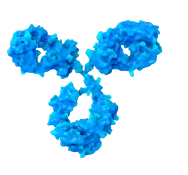
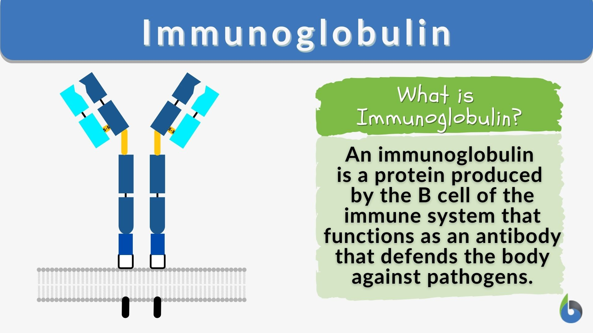
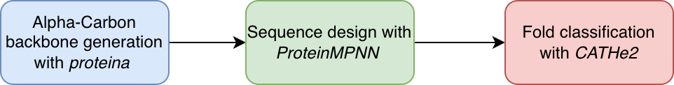

# Immunoglobulin Protein Design Pipeline


Generative protein design pipeline for immunoglobulin backbone synthesis and fold validation using flow-based models and graph neural networks.



## Overview


This project implements an end-to-end generative protein design pipeline focused on immunoglobulin-like folds (CATH 2.60.40.x). The system combines flow-based protein backbone generation (*proteina*), sequence design (*ProteinMPNN*), and structural fold classification (*CATHe2*) to generate and evaluate novel protein candidates computationally.

For a detailed explination of the theoretical apsects of the project, consult the document at `docs/THEORY_EXPLANATION.md`, and a precise technical breakdown can be found at `docs/TECHNICAL_EXPLANATION.md`.





## Architecture



The pipeline works as follows:
- Proteina generates the alpha-carbon backbones
- ProteinMPNN populates the backbones with specific amino acid residues and outputs an amino acid sequence  
- CATHe2 is used to classify and filter the amino acid sequences to verify the ones that are immunoglobulin


## Key Features

- End-to-end automated protein generation pipeline
- Flow-based backbone synthesis using Proteina
- Sequence generation with ProteinMPNN
- Structural fold validation using CATHe2
- Reproducible orchestration with Nextflow
- Modular multi-environment setup

## Results

Example outputs/images

## Technical Stack

- **Backbone generation**: Proteina (flow-based protein structure generation)
- **Sequence design**: ProteinMPNN
- **Fold classification**: CATHe2
- **Pipeline orchestration**: Nextflow
- **Environment management**: Conda
- **Deep learning frameworks**: PyTorch

## Installation
For a detailed explanation on how to setup the project, consult this guide `docs/SETUP.md`. The basic commands are the following:

```
chmod +x setup_envs.sh
bash setup_envs.sh
```
```
conda activate protein_design_env
```
```
python download_large_files.py   
```


## Usage
For a detailed explanation on how to run the project, consult this guide `docs/SETUP.md`. The basic commands are the following:
```
cd pipeline
nextflow run local_pipeline.nf -with-conda

```

## Repository Structure

The repository integrates external state-of-the-art protein generation ([proteina](https://github.com/NVIDIA-Digital-Bio/proteina/)) and classification frameworks ([CATHe2](https://github.com/Mouret-Orfeu/CATHe2)) into a unified reproducible pipeline.
```
.
├── download_large_files.py
├── environment.yaml
├── external
│   ├── CATHe2
│   └── proteina
├── LICENSE
├── pipeline
│   ├── final_results
│   ├── local_pipeline.nf
│   └── work
├── README.md
└── setup_envs.sh
```


## My Contributions
- Designed and implemented an end-to-end protein design pipeline
- Integrated multiple state-of-the-art protein ML models
- Built reproducible multi-environment infrastructure
- Automated orchestration using Nextflow
- Developed filtering and evaluation workflow for immunoglobulin fold candidates

## Future Work

- Structural validation using AlphaFold2/ESMFold
- Energy minimization and stability estimation
- Reinforcement learning for fold optimization
- Interactive visualization dashboard
- Fine-tuning backbone generators on immunoglobulin datasets
## References

Papers/repos